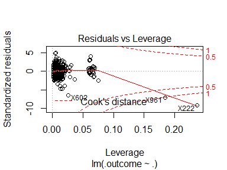

Used Car Price Prediction
================
Daniel Davis

### Introduction

In this case study linear regression models are used to predict used car prices.

### Data Exploration

The csv file containing the car information dataset is read in as a dataframe.

``` r
cars <- read.csv("cars.csv", stringsAsFactors = TRUE)

str(cars)
```

    ## 'data.frame':    1436 obs. of  10 variables:
    ##  $ Price    : int  13500 13750 13950 14950 13750 12950 16900 18600 21500 12950 ...
    ##  $ Age      : int  23 23 24 26 30 32 27 30 27 23 ...
    ##  $ KM       : int  46986 72937 41711 48000 38500 61000 94612 75889 19700 71138 ...
    ##  $ FuelType : Factor w/ 3 levels "CNG","Diesel",..: 2 2 2 2 2 2 2 2 3 2 ...
    ##  $ HP       : int  90 90 90 90 90 90 90 90 192 69 ...
    ##  $ MetColor : int  1 1 1 0 0 0 1 1 0 0 ...
    ##  $ Automatic: int  0 0 0 0 0 0 0 0 0 0 ...
    ##  $ CC       : int  2000 2000 2000 2000 2000 2000 2000 2000 1800 1900 ...
    ##  $ Doors    : int  3 3 3 3 3 3 3 3 3 3 ...
    ##  $ Weight   : int  1165 1165 1165 1165 1170 1170 1245 1245 1185 1105 ...

The dataframe consists of 10 columns, the car price and 9 attributes which may be used to predict that price. A description of the columns is as follows:

``` include
Price Offer price in EUROs
Age: The age of the car in months.
KM: The kilometers traveled by the car.
FuelType: Fuel type as a string value, either petrol, diesel, or CNG for compressed natural gas.
HP: Horsepower of the car.
MetColor: Metallic color indicator variable, with 1 indicating the car has a metallic color.
Automatic: Transmission indicator variable, with 1 indicating an automatic transmission.
CC: Car cylinder volume in cubic centimeters.
Doors: Number of doors as an integer value.
Weight: Car weight in kilograms.
```

``` r
summary(cars)
```

    ##      Price            Age              KM           FuelType   
    ##  Min.   : 4350   Min.   : 1.00   Min.   :     1   CNG   :  17  
    ##  1st Qu.: 8450   1st Qu.:44.00   1st Qu.: 43000   Diesel: 155  
    ##  Median : 9900   Median :61.00   Median : 63390   Petrol:1264  
    ##  Mean   :10731   Mean   :55.95   Mean   : 68533                
    ##  3rd Qu.:11950   3rd Qu.:70.00   3rd Qu.: 87021                
    ##  Max.   :32500   Max.   :80.00   Max.   :243000                
    ##        HP           MetColor        Automatic             CC      
    ##  Min.   : 69.0   Min.   :0.0000   Min.   :0.00000   Min.   :1300  
    ##  1st Qu.: 90.0   1st Qu.:0.0000   1st Qu.:0.00000   1st Qu.:1400  
    ##  Median :110.0   Median :1.0000   Median :0.00000   Median :1600  
    ##  Mean   :101.5   Mean   :0.6748   Mean   :0.05571   Mean   :1567  
    ##  3rd Qu.:110.0   3rd Qu.:1.0000   3rd Qu.:0.00000   3rd Qu.:1600  
    ##  Max.   :192.0   Max.   :1.0000   Max.   :1.00000   Max.   :2000  
    ##      Doors           Weight    
    ##  Min.   :2.000   Min.   :1000  
    ##  1st Qu.:3.000   1st Qu.:1040  
    ##  Median :4.000   Median :1070  
    ##  Mean   :4.033   Mean   :1072  
    ##  3rd Qu.:5.000   3rd Qu.:1085  
    ##  Max.   :5.000   Max.   :1615

The dataset includes a wide range of both car prices and kilometers traveled with cars ranging from nearly new to nearly 7 years old, and at least one car with only one kilometer traveled.


Car age has the greatest correlation with price. Age is followed by weight and kilometers traveled, which have nearly identical correlations, but with opposite signs. Horsepower has the fourth greatest correlation, and the other included attributes do not appear to be correlated with price to a degree than would be useful for prediction. The plots below display the relationship between price and the four attributes with the largest correlations between themselves and price.


The correlations are clearly demonstrated in these plots. There is an interesting grouping of three vehicles with the highest prices.

``` r
head(cars[rev(order(cars$Price)),], 3)
```

    ##     Price Age   KM FuelType  HP MetColor Automatic   CC Doors Weight
    ## 110 32500   4    1   Diesel 116        0         0 2000     5   1480
    ## 112 31275   4 1500   Diesel 116        1         0 2000     5   1480
    ## 111 31000   4 4000   Diesel 116        1         0 2000     5   1480

It appears that these three may be the same model and year as each other.

### Analysis

A linear regression model is chosen for car price prediction. More complex methods such as random forests may likely achieve better results on this data, but a linear regression model would be well suited for interpretation of the results. The two attributes which likely contribute the most to used car price- car model and car condition are not included in this dataset. Car model, age, mileage (or kilometers traveled), and condition would be enough to predict car pricing with a very high degree of predictive success using nearly any algorithm type. With this dataset it is more important to use a model which can help to reveal and explain associations.

``` r
lm_control <- trainControl(method = "cv")
set.seed(358)
regression_model <- train(Price ~ ., data = cars, method = "lm", trControl = lm_control)


summary(regression_model$finalModel)
```

    ## 
    ## Call:
    ## lm(formula = .outcome ~ ., data = dat)
    ## 
    ## Residuals:
    ##      Min       1Q   Median       3Q      Max 
    ## -10642.3   -737.7      3.1    731.3   6451.5 
    ## 
    ## Coefficients:
    ##                  Estimate Std. Error t value Pr(>|t|)    
    ## (Intercept)    -3.801e+03  1.304e+03  -2.915 0.003613 ** 
    ## Age            -1.220e+02  2.602e+00 -46.889  < 2e-16 ***
    ## KM             -1.621e-02  1.313e-03 -12.347  < 2e-16 ***
    ## FuelTypeDiesel  3.390e+03  5.188e+02   6.535 8.86e-11 ***
    ## FuelTypePetrol  1.121e+03  3.324e+02   3.372 0.000767 ***
    ## HP              6.081e+01  5.756e+00  10.565  < 2e-16 ***
    ## MetColor        5.716e+01  7.494e+01   0.763 0.445738    
    ## Automatic       3.303e+02  1.571e+02   2.102 0.035708 *  
    ## CC             -4.174e+00  5.453e-01  -7.656 3.53e-14 ***
    ## Doors          -7.776e+00  4.006e+01  -0.194 0.846129    
    ## Weight          2.001e+01  1.203e+00  16.629  < 2e-16 ***
    ## ---
    ## Signif. codes:  0 '***' 0.001 '**' 0.01 '*' 0.05 '.' 0.1 ' ' 1
    ## 
    ## Residual standard error: 1316 on 1425 degrees of freedom
    ## Multiple R-squared:  0.8693, Adjusted R-squared:  0.8684 
    ## F-statistic:   948 on 10 and 1425 DF,  p-value: < 2.2e-16

The minimum and maximum residuals show some extreme deviation from true car price at least for two values, but the middle half of the predicted prices do fall within a range of less than 1470 in total. A majority of the attributes are shown to have highly significant relationships with car price as well.

``` r
regression_model
```

    ## Linear Regression 
    ## 
    ## 1436 samples
    ##    9 predictor
    ## 
    ## No pre-processing
    ## Resampling: Cross-Validated (10 fold) 
    ## Summary of sample sizes: 1292, 1292, 1293, 1292, 1293, 1293, ... 
    ## Resampling results:
    ## 
    ##   RMSE      Rsquared   MAE     
    ##   1344.049  0.8640044  961.2119
    ## 
    ## Tuning parameter 'intercept' was held constant at a value of TRUE



The plot of fitted values and residuals shows a very slight hyperbola with clustering on the left-hand side, however the curve may not be severe enough to be a sign of non-linear relationships.

The quantiles and residuals is much as expected, with most values falling neatly on the line indicating a normal distribution.

There is some clustering on the left-hand side of the fitted values and square root residuals plot, but the distribution leads to a fairly horizontal line for variance.

The leverage and residuals plot shows that all values fall fairly well inside of the Cook's distance lines, with the exception of three outliers which appear to have a significant impact on the regression model. These outliers are shown on each plot, and likely fall outside the norm of the other observations.

``` r
cars[c(602, 961, 222),]
```

    ##     Price Age    KM FuelType  HP MetColor Automatic   CC Doors Weight
    ## 602  7500  50     1   Diesel  90        1         0 2000     3   1260
    ## 961  9390  66 50806   Petrol  86        0         0 1300     3   1480
    ## 222 12450  44 74172   Petrol 110        1         0 1600     5   1615

Observation 602 especially is a clear outlier, which may have been a show car or simply may have never been sold. These outliers are removed from the dataset and the model is built again.

``` r
cars <- cars[-c(602, 961, 222),]
```

``` r
lm_control <- trainControl(method = "cv")
set.seed(358)
regression_model <- train(Price ~ ., data = cars, method = "lm", trControl = lm_control)


summary(regression_model$finalModel)
```

    ## 
    ## Call:
    ## lm(formula = .outcome ~ ., data = dat)
    ## 
    ## Residuals:
    ##     Min      1Q  Median      3Q     Max 
    ## -6786.6  -763.4   -24.7   697.0  6179.1 
    ## 
    ## Coefficients:
    ##                  Estimate Std. Error t value Pr(>|t|)    
    ## (Intercept)    -1.785e+04  1.488e+03 -11.991  < 2e-16 ***
    ## Age            -1.106e+02  2.478e+00 -44.635  < 2e-16 ***
    ## KM             -1.586e-02  1.210e-03 -13.108  < 2e-16 ***
    ## FuelTypeDiesel  1.510e+03  4.906e+02   3.078  0.00212 ** 
    ## FuelTypePetrol  1.574e+03  3.057e+02   5.149 2.98e-07 ***
    ## HP              3.325e+01  5.560e+00   5.980 2.82e-09 ***
    ## MetColor        6.142e+01  6.859e+01   0.895  0.37071    
    ## Automatic      -1.513e+02  1.468e+02  -1.031  0.30292    
    ## CC             -3.601e+00  5.003e-01  -7.197 9.91e-13 ***
    ## Doors          -1.854e+02  3.826e+01  -4.847 1.39e-06 ***
    ## Weight          3.480e+01  1.444e+00  24.090  < 2e-16 ***
    ## ---
    ## Signif. codes:  0 '***' 0.001 '**' 0.01 '*' 0.05 '.' 0.1 ' ' 1
    ## 
    ## Residual standard error: 1203 on 1422 degrees of freedom
    ## Multiple R-squared:  0.8908, Adjusted R-squared:  0.8901 
    ## F-statistic:  1160 on 10 and 1422 DF,  p-value: < 2.2e-16

The minimum and maximum residuals are still quite substantial, but there is a large difference seen between this and the previous model, which shows the effect the outlying variables had on the measures of predicted success. The interquartile range was affected only slightly by the change, however. Most of the residuals, especially for predictions that were too high, could be accounted for by car condition. Most of the attributes are found to have highly significant relationships with car price, with some changes being seen from the previous model. The doors attribute relationship is now seen to be highly significant, and the transmission indicator attribute relationship is no longer significant.

``` r
regression_model
```

    ## Linear Regression 
    ## 
    ## 1433 samples
    ##    9 predictor
    ## 
    ## No pre-processing
    ## Resampling: Cross-Validated (10 fold) 
    ## Summary of sample sizes: 1291, 1290, 1290, 1289, 1290, 1289, ... 
    ## Resampling results:
    ## 
    ##   RMSE      Rsquared   MAE    
    ##   1208.835  0.8871805  910.544
    ## 
    ## Tuning parameter 'intercept' was held constant at a value of TRUE

Removing those three outliers had a tremendous effect on the error measurements displayed. The root mean squared error was affected the most, which is natural as it is most sensitive to large outlying values.


These plots reveal that the model now has a much better fit with the dataset, especially the plot of leverage and standardized residuals

### Conclusion

The linear regression model was able to capture the cars dataset attributes' relationship to car price with a large degree of success. Predictive results were successful on average with variation that can be explained by known factors not included in the dataset. It is clear however that linear regression models can be sensitive to extreme outlier values in a way that other methods such as decision trees would be largely resilient to.

#### References

Kim, B. (2015). Understanding Diagnostic Plots for Linear Regression Analysis. Retrieved December 09, 2017, from <http://data.library.virginia.edu/diagnostic-plots/>

Lantz, B. (2015). Machine learning with R: discover how to build machine learning algorithms, prepare data, and dig deep into data prediction techniques with R. Birmingham: PACKT Publishing.
