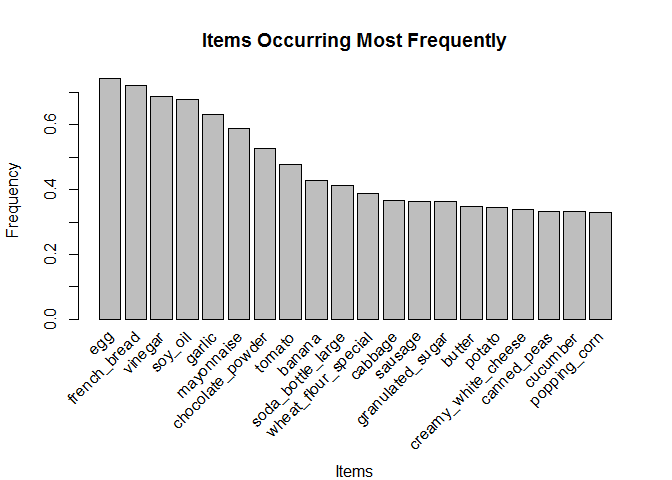
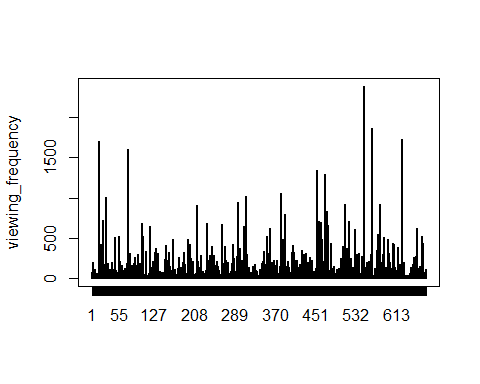
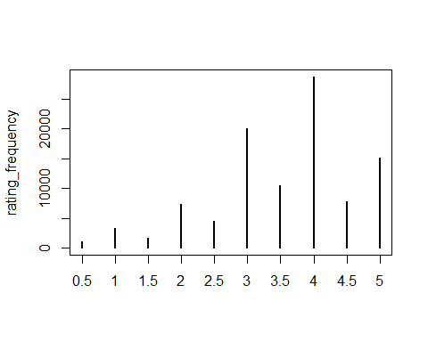

Household Survey Transactions and Movie Survey Transactions
================
Daniel Davis

### Household Survey

Information for different families and their grocery purchases are analyzed using the apriori algorithm to create a set of generalized rules. The dataset analyzed includes the city where each family is located, the family's income range, the number of family members, and items purchased by the family. There are 8 different cities, 8 income ranges, and 7 family member number categories that each family belongs in.

The csv file containing the dataset is read in as a transactions object. The read.transactions function allows the dataset structure, which tied each family transaction together with an id value, to be read in properly so that each data type remains tied in with the correct family.

``` r
household <- read.transactions("household_survey.csv", format = "single", cols = c(1,2), sep = ",")
```

``` r
itemFrequencyPlot(household, support = 0.01, topN = 20, main = "Items Occurring Most Frequently", xlab = "Items", ylab = "Frequency")
```



The apriori algorithm is used to create a set of rules from the household transaction sparse matrix. Boundaries for numbers of items in the rules are set, so that all rules contain between 2 and 4 items in an attempt to keep the rules small and actionable. The default parameters for support and confidence are used. For this rule set the five most frequent items are excluded. They each appeared in the vast majority of the transactions, so any rule containing those items is likely to be obvious.

``` r
summary(household_rules)
```

    ## set of 36 rules
    ## 
    ## rule length distribution (lhs + rhs):sizes
    ##  2  3  4 
    ##  1 34  1 
    ## 
    ##    Min. 1st Qu.  Median    Mean 3rd Qu.    Max. 
    ##       2       3       3       3       3       4 
    ## 
    ## summary of quality measures:
    ##     support         confidence          lift           count      
    ##  Min.   :0.1006   Min.   :0.8000   Min.   :1.360   Min.   :155.0  
    ##  1st Qu.:0.1114   1st Qu.:0.8171   1st Qu.:1.389   1st Qu.:171.5  
    ##  Median :0.1179   Median :0.8242   Median :1.401   Median :181.5  
    ##  Mean   :0.1230   Mean   :0.8304   Mean   :1.412   Mean   :189.5  
    ##  3rd Qu.:0.1229   3rd Qu.:0.8476   3rd Qu.:1.441   3rd Qu.:189.2  
    ##  Max.   :0.2513   Max.   :0.8738   Max.   :1.485   Max.   :387.0  
    ## 
    ## mining info:
    ##       data ntransactions support confidence
    ##  household          1540     0.1        0.8

The created rule set has relatively high support and confidence values, as well as reasonable lift values.

``` r
inspect(sort(household_rules, by='confidence', decreasing = TRUE))
```

    ##      lhs                                               rhs          support   confidence lift     count
    ## [1]  {ketchup,wheat_flour_special}                  => {mayonnaise} 0.1168831 0.8737864  1.485244 180  
    ## [2]  {ketchup,soda_bottle_large}                    => {mayonnaise} 0.1188312 0.8714286  1.481236 183  
    ## [3]  {cabbage,ketchup}                              => {mayonnaise} 0.1207792 0.8651163  1.470507 186  
    ## [4]  {canned_peas,watermelon}                       => {mayonnaise} 0.1142857 0.8585366  1.459323 176  
    ## [5]  {chocolate_powder,ketchup}                     => {mayonnaise} 0.1655844 0.8557047  1.454509 255  
    ## [6]  {canned_peas,ketchup}                          => {mayonnaise} 0.1201299 0.8525346  1.449121 185  
    ## [7]  {canned_sardine,ketchup}                       => {mayonnaise} 0.1012987 0.8524590  1.448992 156  
    ## [8]  {cabbage,canned_peas}                          => {mayonnaise} 0.1337662 0.8512397  1.446920 206  
    ## [9]  {banana,ketchup}                               => {mayonnaise} 0.1129870 0.8487805  1.442739 174  
    ## [10] {canned_peas,cucumber}                         => {mayonnaise} 0.1188312 0.8472222  1.440091 183  
    ## [11] {canned_peas,sausage}                          => {mayonnaise} 0.1402597 0.8437500  1.434189 216  
    ## [12] {canned_peas,canned_sardine}                   => {mayonnaise} 0.1155844 0.8436019  1.433937 178  
    ## [13] {cabbage,chocolate_powder,wheat_flour_special} => {mayonnaise} 0.1025974 0.8359788  1.420979 158  
    ## [14] {canned_peas,wheat_flour_special}              => {mayonnaise} 0.1272727 0.8340426  1.417688 196  
    ## [15] {beer_can,chocolate_powder}                    => {mayonnaise} 0.1006494 0.8333333  1.416483 155  
    ## [16] {cucumber,ketchup}                             => {mayonnaise} 0.1077922 0.8300000  1.410817 166  
    ## [17] {canned_peas,cauliflower}                      => {mayonnaise} 0.1233766 0.8260870  1.404165 190  
    ## [18] {canned_peas,soda_bottle_large}                => {mayonnaise} 0.1227273 0.8253275  1.402875 189  
    ## [19] {canned_peas,creamy_white_cheese}              => {mayonnaise} 0.1389610 0.8230769  1.399049 214  
    ## [20] {creamy_white_cheese,cucumber}                 => {mayonnaise} 0.1194805 0.8214286  1.396247 184  
    ## [21] {ketchup,popping_corn}                         => {mayonnaise} 0.1006494 0.8201058  1.393999 155  
    ## [22] {canned_peas,green_beans}                      => {mayonnaise} 0.1181818 0.8198198  1.393513 182  
    ## [23] {canned_peas,chocolate_powder}                 => {mayonnaise} 0.1798701 0.8195266  1.393014 277  
    ## [24] {canned_peas,tomato}                           => {mayonnaise} 0.1175325 0.8190045  1.392127 181  
    ## [25] {ketchup,tomato}                               => {mayonnaise} 0.1227273 0.8181818  1.390728 189  
    ## [26] {canned_peas,popping_corn}                     => {mayonnaise} 0.1019481 0.8177083  1.389924 157  
    ## [27] {canned_peas,ice_cream_bar}                    => {mayonnaise} 0.1103896 0.8173077  1.389243 170  
    ## [28] {ketchup}                                      => {mayonnaise} 0.2512987 0.8164557  1.387794 387  
    ## [29] {creamy_white_cheese,wheat_flour_special}      => {mayonnaise} 0.1233766 0.8154506  1.386086 190  
    ## [30] {cabbage,canned_sardine}                       => {mayonnaise} 0.1006494 0.8115183  1.379402 155  
    ## [31] {broccoli,canned_peas}                         => {mayonnaise} 0.1025974 0.8102564  1.377257 158  
    ## [32] {broccoli,chocolate_powder}                    => {mayonnaise} 0.1129870 0.8093023  1.375635 174  
    ## [33] {cauliflower,creamy_white_cheese}              => {mayonnaise} 0.1175325 0.8044444  1.367378 181  
    ## [34] {butter,canned_peas}                           => {mayonnaise} 0.1188312 0.8026316  1.364297 183  
    ## [35] {butter,canned_sardine}                        => {mayonnaise} 0.1116883 0.8000000  1.359823 172  
    ## [36] {creamy_white_cheese,green_beans}              => {mayonnaise} 0.1168831 0.8000000  1.359823 180

The entirety of the rule set is printed above. Unfortunately each item consists of mayonnaise, the 6th most frequent item, on the right hand side. Below, the rules with the highest support are examined. Below, another rule set is created, excluding the top ten most frequent items. The support and confidence thresholds are lowered to ensure that rules are created.

``` r
summary(household_rules)
```

    ## set of 3257 rules
    ## 
    ## rule length distribution (lhs + rhs):sizes
    ##    2    3    4 
    ##  755 2282  220 
    ## 
    ##    Min. 1st Qu.  Median    Mean 3rd Qu.    Max. 
    ##   2.000   3.000   3.000   2.836   3.000   4.000 
    ## 
    ## summary of quality measures:
    ##     support          confidence          lift           count      
    ##  Min.   :0.05000   Min.   :0.4000   Min.   :1.029   Min.   : 77.0  
    ##  1st Qu.:0.05325   1st Qu.:0.4527   1st Qu.:1.402   1st Qu.: 82.0  
    ##  Median :0.05909   Median :0.5090   Median :1.569   Median : 91.0  
    ##  Mean   :0.06605   Mean   :0.5325   Mean   :1.836   Mean   :101.7  
    ##  3rd Qu.:0.06948   3rd Qu.:0.5870   3rd Qu.:1.989   3rd Qu.:107.0  
    ##  Max.   :0.18247   Max.   :0.9318   Max.   :5.976   Max.   :281.0  
    ## 
    ## mining info:
    ##       data ntransactions support confidence
    ##  household          1540    0.05        0.4

A decent number of rules have been created, with average confidence levels that indicate the rules may be useful.

``` r
inspect(sort(household_rules, by='lift', decreasing = TRUE)[1:20])
```

    ##      lhs                                            rhs                support    confidence lift     count
    ## [1]  {beans_other_kind,cream_cracker_biscuits}   => {City_Fortaleza}   0.05259740 0.8265306  5.975855 81   
    ## [2]  {potato,salt,spread_margarine}              => {onion}            0.05194805 0.8247423  5.695530 80   
    ## [3]  {carrot,tagliatelle_pasta}                  => {pepper}           0.05129870 0.5724638  5.687705 79   
    ## [4]  {carrot,potato,spread_margarine}            => {onion}            0.05324675 0.8118812  5.606713 82   
    ## [5]  {coffee,potato,spread_margarine}            => {onion}            0.05259740 0.7788462  5.378579 81   
    ## [6]  {potato,spread_margarine,tagliatelle_pasta} => {onion}            0.05194805 0.7766990  5.363751 80   
    ## [7]  {carrot,potato,tagliatelle_pasta}           => {onion}            0.05064935 0.7572816  5.229657 78   
    ## [8]  {carrot,orange,potato}                      => {onion}            0.05000000 0.7549020  5.213224 77   
    ## [9]  {coffee,potato,salt}                        => {onion}            0.05259740 0.7500000  5.179372 81   
    ## [10] {coffee,orange,salt}                        => {onion}            0.05000000 0.7333333  5.064275 77   
    ## [11] {coffee,potato,tagliatelle_pasta}           => {onion}            0.05064935 0.7289720  5.034156 78   
    ## [12] {carrot,spread_margarine}                   => {onion}            0.05714286 0.7154472  4.940756 88   
    ## [13] {carrot,potato}                             => {pepper}           0.05259740 0.4879518  4.848037 81   
    ## [14] {spread_margarine,tagliatelle_pasta}        => {onion}            0.05714286 0.6984127  4.823119 88   
    ## [15] {carrot,frozen_chicken}                     => {onion}            0.05000000 0.6936937  4.790530 77   
    ## [16] {City_Fortaleza,cream_cracker_biscuits}     => {beans_other_kind} 0.05259740 0.5547945  4.773093 81   
    ## [17] {salt,spread_margarine}                     => {onion}            0.05584416 0.6718750  4.639854 86   
    ## [18] {carrot,salt}                               => {onion}            0.05649351 0.6692308  4.621594 87   
    ## [19] {carrot,coffee}                             => {onion}            0.05779221 0.6691729  4.621194 89   
    ## [20] {coffee,frozen_chicken}                     => {onion}            0.05194805 0.6666667  4.603886 80

With this rule set some very high lift values are seen. Onions especially are bought much more frequently with other items than separately. A csv file of this rule set is available at the following link:

[household transactions rule set](household_rules.csv)

#### Rules by City

Below, the rule set is investigated for information that can be gleaned about cities individually.

``` r
cities <- c("City_Belem", "City_Belo_Horizonte", "City_Curitiba", "City_Florianopolis", "City_Fortaleza", "City_Goiania", "City_Porto_Alegre", "City_Recife")

inspect(sort(subset(household_rules, subset = rhs %in% cities | lhs %in% cities), by='lift', decreasing = TRUE)[1:20])
```

    ##      lhs                                          rhs                      support    confidence lift    
    ## [1]  {beans_other_kind,cream_cracker_biscuits} => {City_Fortaleza}         0.05259740 0.8265306  5.975855
    ## [2]  {City_Fortaleza,cream_cracker_biscuits}   => {beans_other_kind}       0.05259740 0.5547945  4.773093
    ## [3]  {City_Fortaleza}                          => {beans_other_kind}       0.07207792 0.5211268  4.483437
    ## [4]  {beans_other_kind}                        => {City_Fortaleza}         0.07207792 0.6201117  4.483437
    ## [5]  {granulated_sugar,salt}                   => {City_Goiania}           0.05649351 0.5028902  4.278734
    ## [6]  {City_Recife}                             => {coriander}              0.06883117 0.5300000  3.962136
    ## [7]  {coriander}                               => {City_Recife}            0.06883117 0.5145631  3.962136
    ## [8]  {annatto}                                 => {City_Fortaleza}         0.05519481 0.5089820  3.679964
    ## [9]  {cream_cracker_biscuits,flour}            => {City_Fortaleza}         0.05194805 0.4878049  3.526852
    ## [10] {granulated_sugar,orange}                 => {City_Goiania}           0.05519481 0.4028436  3.427509
    ## [11] {other_fishes}                            => {City_Fortaleza}         0.05194805 0.4232804  3.060337
    ## [12] {City_Goiania,granulated_sugar}           => {salt}                   0.05649351 0.6397059  2.872149
    ## [13] {City_Fortaleza,flour}                    => {cream_cracker_biscuits} 0.05194805 0.7692308  2.575251
    ## [14] {City_Goiania,orange}                     => {granulated_sugar}       0.05519481 0.9139785  2.513441
    ## [15] {City_Goiania}                            => {frozen_chicken}         0.05000000 0.4254144  2.491019
    ## [16] {City_Goiania}                            => {salt}                   0.06428571 0.5469613  2.455745
    ## [17] {City_Fortaleza,potato}                   => {cream_cracker_biscuits} 0.05324675 0.7321429  2.451087
    ## [18] {beans_other_kind,City_Fortaleza}         => {cream_cracker_biscuits} 0.05259740 0.7297297  2.443008
    ## [19] {City_Goiania,granulated_sugar}           => {orange}                 0.05519481 0.6250000  2.430556
    ## [20] {City_Goiania,salt}                       => {granulated_sugar}       0.05649351 0.8787879  2.416667
    ##      count
    ## [1]   81  
    ## [2]   81  
    ## [3]  111  
    ## [4]  111  
    ## [5]   87  
    ## [6]  106  
    ## [7]  106  
    ## [8]   85  
    ## [9]   80  
    ## [10]  85  
    ## [11]  80  
    ## [12]  87  
    ## [13]  80  
    ## [14]  85  
    ## [15]  77  
    ## [16]  99  
    ## [17]  82  
    ## [18]  81  
    ## [19]  85  
    ## [20]  87

The rule set does reveal some city-specific rules, such as annato in Fortaleza and coriander in Recife.

``` r
household_frequency <- itemFrequency(household)

household_frequency[cities]
```

    ##          City_Belem City_Belo_Horizonte       City_Curitiba  City_Florianopolis      City_Fortaleza 
    ##          0.09025974          0.13376623          0.13311688          0.12272727          0.13831169 
    ##        City_Goiania   City_Porto_Alegre         City_Recife 
    ##          0.11753247          0.13441558          0.12987013

For the most part the cities are represented fairly evenly in the dataset, so it does not appear that these rules only reflect which cities are included the most in the dataset.the high lift values seen suggests that these rules may be valuable insights.

#### Rules by Income

Below, the rule set is investigated for differences across income groups.

The eight income groups included in the transactions set are as follows:

``` include
Income_below_2.5
Income_2.5_to_5
Income_5_to_8
Income_8_to_12
Income_12_to_18
Income_18_to_25
Income_25_to_43
Income_above_43
```

``` r
income <- c("Income_below_2.5", "Income_2.5_to_5", "Income_5_to_8", "Income_8_to_12", "Income_12_to_18", "Income_18_to_25", "Income_25_to_43", "Income_above_43")
```

``` r
household_frequency[income]
```

    ## Income_below_2.5  Income_2.5_to_5    Income_5_to_8   Income_8_to_12  Income_12_to_18  Income_18_to_25 
    ##       0.05649351       0.13831169       0.18051948       0.18116883       0.16623377       0.10779221 
    ##  Income_25_to_43  Income_above_43 
    ##       0.10909091       0.06038961

The income distribution is skewed slightly to the right, with far lower frequencies for the lowest and highest groups.

``` r
inspect(subset(household_rules, subset = rhs %in%  income | lhs %in% income))
```

    ##      lhs                  rhs                   support    confidence lift     count
    ## [1]  {Income_2.5_to_5} => {potato}              0.06493506 0.4694836  1.364160 100  
    ## [2]  {Income_2.5_to_5} => {granulated_sugar}    0.06948052 0.5023474  1.381455 107  
    ## [3]  {Income_25_to_43} => {cauliflower}         0.05324675 0.4880952  1.572524  82  
    ## [4]  {Income_25_to_43} => {butter}              0.05064935 0.4642857  1.338951  78  
    ## [5]  {Income_25_to_43} => {canned_peas}         0.05454545 0.5000000  1.498054  84  
    ## [6]  {Income_25_to_43} => {creamy_white_cheese} 0.06103896 0.5595238  1.644402  94  
    ## [7]  {Income_5_to_8}   => {granulated_sugar}    0.07727273 0.4280576  1.177158 119  
    ## [8]  {Income_5_to_8}   => {wheat_flour_special} 0.07532468 0.4172662  1.070983 116  
    ## [9]  {Income_12_to_18} => {canned_peas}         0.06883117 0.4140625  1.240576 106  
    ## [10] {Income_12_to_18} => {creamy_white_cheese} 0.07597403 0.4570312  1.343183 117  
    ## [11] {Income_8_to_12}  => {wheat_flour_special} 0.07337662 0.4050179  1.039546 113

Only 11 rules were created that included an income group, and these are so specific that it would be difficult to draw conclusions. For more income-based analysis it would be worthwhile to investigate item price. It is important to note that low lift values were seen for most of these rules.

To see if more rules can be created a new rule set is created which does include the most frequent items. Support and confidence are left at low values, at 0.05 and 0.4 respectively.

``` r
summary(household_rules_new)
```

    ## set of 44632 rules
    ## 
    ## rule length distribution (lhs + rhs):sizes
    ##     2     3     4 
    ##  2183 15141 27308 
    ## 
    ##    Min. 1st Qu.  Median    Mean 3rd Qu.    Max. 
    ##   2.000   3.000   4.000   3.563   4.000   4.000 
    ## 
    ## summary of quality measures:
    ##     support          confidence          lift            count      
    ##  Min.   :0.05000   Min.   :0.4000   Min.   :0.6603   Min.   : 77.0  
    ##  1st Qu.:0.05519   1st Qu.:0.5031   1st Qu.:1.1571   1st Qu.: 85.0  
    ##  Median :0.06364   Median :0.6721   Median :1.2813   Median : 98.0  
    ##  Mean   :0.07489   Mean   :0.6518   Mean   :1.3766   Mean   :115.3  
    ##  3rd Qu.:0.08117   3rd Qu.:0.7953   3rd Qu.:1.4567   3rd Qu.:125.0  
    ##  Max.   :0.55325   Max.   :0.9647   Max.   :5.9759   Max.   :852.0  
    ## 
    ## mining info:
    ##       data ntransactions support confidence
    ##  household          1540    0.05        0.4

Many more rules were created by the inclusion of the most frequent items. The updated rule set csv file can be downloaded at the following link:

[updated household transactions rule set](household_rules_new.csv)

``` r
inspect(sort(subset(household_rules_new, subset = lhs %in% income), by='lift', decreasing = TRUE)[1:20])
```

    ##      lhs                                       rhs                   support    confidence lift     count
    ## [1]  {Income_25_to_43}                      => {creamy_white_cheese} 0.06103896 0.5595238  1.644402 94   
    ## [2]  {Income_12_to_18,mayonnaise,vinegar}   => {creamy_white_cheese} 0.05129870 0.5448276  1.601211 79   
    ## [3]  {Income_12_to_18,mayonnaise,vinegar}   => {canned_peas}         0.05000000 0.5310345  1.591037 77   
    ## [4]  {Income_25_to_43}                      => {cauliflower}         0.05324675 0.4880952  1.572524 82   
    ## [5]  {Income_12_to_18,vinegar}              => {creamy_white_cheese} 0.06428571 0.5210526  1.531338 99   
    ## [6]  {french_bread,Income_5_to_8,soy_oil}   => {beetroot}            0.05064935 0.4727273  1.523013 78   
    ## [7]  {Income_12_to_18,mayonnaise}           => {creamy_white_cheese} 0.05974026 0.5139665  1.510512 92   
    ## [8]  {garlic,Income_2.5_to_5}               => {banana}              0.05454545 0.6461538  1.509980 84   
    ## [9]  {Income_25_to_43}                      => {canned_peas}         0.05454545 0.5000000  1.498054 84   
    ## [10] {french_bread,Income_2.5_to_5}         => {granulated_sugar}    0.05389610 0.5389610  1.482143 83   
    ## [11] {Income_2.5_to_5,soy_oil}              => {granulated_sugar}    0.05909091 0.5384615  1.480769 91   
    ## [12] {Income_12_to_18,mayonnaise}           => {canned_peas}         0.05714286 0.4916201  1.472947 88   
    ## [13] {canned_peas,Income_12_to_18,vinegar}  => {mayonnaise}          0.05000000 0.8555556  1.454256 77   
    ## [14] {Income_12_to_18,soy_oil}              => {creamy_white_cheese} 0.05584416 0.4914286  1.444275 86   
    ## [15] {garlic,Income_12_to_18}               => {creamy_white_cheese} 0.05064935 0.4875000  1.432729 78   
    ## [16] {french_bread,Income_25_to_43,vinegar} => {mayonnaise}          0.05064935 0.8387097  1.425621 78   
    ## [17] {Income_12_to_18,vinegar}              => {canned_peas}         0.05844156 0.4736842  1.419210 90   
    ## [18] {Income_8_to_12,mayonnaise}            => {canned_peas}         0.05194805 0.4733728  1.418276 80   
    ## [19] {canned_peas,Income_12_to_18}          => {mayonnaise}          0.05714286 0.8301887  1.411137 88   
    ## [20] {Income_8_to_12,vinegar}               => {canned_sardine}      0.05454545 0.4137931  1.400531 84

The rules with the highest lift are examined. Unfortunately the lift values are rather low, and again are difficult to generalize.

### Conclusion

From this analysis it is possible to gain insight into some differences between groceries purchased by cities, but there is little insight to be gained from income distributions. More specific item classes would be better suited to this specific task- such as higher and lower priced varieties of items.

Movie Survey
------------

This study focuses on rule set creation for movie watching and rating data using the Apriori algorithm provided in the R Arules package.

The two movie information files are read in as data frames.

``` r
movies <- read.csv("movies.csv")
ratings <- read.csv("ratings.csv")
```

``` r
summary(movies)
```

    ##     movieId                                           title                 genres    
    ##  Min.   :     1   Hamlet (2000)                          :   2   Drama         :1170  
    ##  1st Qu.:  2850   War of the Worlds (2005)               :   2   Comedy        : 809  
    ##  Median :  6290   'burbs, The (1989)                     :   1   Comedy|Drama  : 425  
    ##  Mean   : 31123   'Hellboy': The Seeds of Creation (2004):   1   Documentary   : 365  
    ##  3rd Qu.: 56274   'Neath the Arizona Skies (1934)        :   1   Drama|Romance : 356  
    ##  Max.   :164979   'night Mother (1986)                   :   1   Comedy|Romance: 341  
    ##                   (Other)                                :9117   (Other)       :5659

Many of the genre categories are multiples of each other. This may be an issued as it leads to over specific categories.

``` r
 length(unique(movies$movieId))
```

    ## [1] 9125

9125 movies are included, so it is likely that decent rules and generalizations can be gleaned from this data.

``` r
summary(ratings)
```

    ##      userId       movieId           rating        timestamp        
    ##  Min.   :  1   Min.   :     1   Min.   :0.500   Min.   :7.897e+08  
    ##  1st Qu.:182   1st Qu.:  1028   1st Qu.:3.000   1st Qu.:9.658e+08  
    ##  Median :367   Median :  2406   Median :4.000   Median :1.110e+09  
    ##  Mean   :347   Mean   : 12549   Mean   :3.544   Mean   :1.130e+09  
    ##  3rd Qu.:520   3rd Qu.:  5418   3rd Qu.:4.000   3rd Qu.:1.296e+09  
    ##  Max.   :671   Max.   :163949   Max.   :5.000   Max.   :1.477e+09

The movie ratings are skewed to the right, but there is an important distinction that these represent all ratings made, not the ratings for each movie.

``` r
 length(unique(ratings$movieId))
```

    ## [1] 9066

It appears that not every movie included in the movie file has a rating linked to it. Those movies without ratings are removed from the movie dataframe below.

``` r
#Non-matching IDs are located.
excluded_films  <- which(!(movies$movieId %in% ratings$movieId))

#Non-matching IDs are removed.
movies <- movies[-excluded_films,]

# The new number of movies is tested.
length(unique(movies$movieId))
```

    ## [1] 9066

The timestamp attribute likely refers to when each rating was made. This is unlikely to provide any relevant information on the movies, so the attribute is removed from the ratings dataframe.

``` r
ratings$timestamp <- NULL
```

``` r
length(unique(ratings$userId))
```

    ## [1] 671

There are 671 unique user IDs included in the ratings dataset. Below, the most frequent user IDs are shown, which indicates how many movies these users have viewed.

``` r
sort(table(ratings$userId),decreasing=TRUE)[1:10]
```

    ## 
    ##  547  564  624   15   73  452  468  380  311   30 
    ## 2391 1868 1735 1700 1610 1340 1291 1063 1019 1011

With the top 10 users having viewed over a thousand to well over 2000 films.If these values were consistent for all reviewers then it would likely be difficult to create any meaningful association rules. However, the averages are well below these maximum values.

``` r
viewing_frequency <- sort(table(ratings$userId),decreasing=TRUE)
#Calculate the mean value
mean(viewing_frequency)
```

    ## [1] 149.0373

``` r
#Calculate the median value
median(viewing_frequency)
```

    ## 379 
    ##  71



This plot reveals that there are a large number of power users who view far more than the average number of films. Below, the movie ratings are evaluated.

``` r
summary(ratings$rating)
```

    ##    Min. 1st Qu.  Median    Mean 3rd Qu.    Max. 
    ##   0.500   3.000   4.000   3.544   4.000   5.000

The movie ratings are skewed to the right, with very few movies receiving low ratings.



This plot reveals an interesting distribution, as all half ratings are significantly lower than their full rating neighbors. This does make sense for movie ratings however, as users would be likely to bother with giving or taking away half points only for special circumstances or particular reasons.

#### Analysis

To create association rules, the two datasets are merged and converted into a transactions object. The function documentation recommends reading in single file-style data rather than directly converting, so this is accomplished by writing out to a csv file and then reading the file in using the Arules read.transactions function. Because movie ID and timestamps are not relevant for association rules, they are omitted from the dataset. Investigation of genres and ratings is also not suitable for association rule analysis, as this can be more easily accomplished with simpler, more straightforward techniques.

``` r
#The datasets are merged by the movieID attribute.
movie_merged <- merge(movies, ratings, by= "movieId")

#Movie Id and timestamps are removed. Columns are rearranged so userID is first.
movie_titles <- movie_merged[,c(4,2,3,5)]

#To improve performance the dataframe is written to a csv file and then read in as a transactions object.
write.csv(movie_titles, "movie_rules.csv", row.names=FALSE)

movie_data <- read.transactions("movie_rules.csv", format = "single", cols = c(1,2), sep = ",")
```

The Apriori algorithm is run with the default parameters on the transactions object.

``` r
movie_rules <- apriori(movie_data)
```

    ## Apriori
    ## 
    ## Parameter specification:
    ##  confidence minval smax arem  aval originalSupport maxtime support minlen maxlen target   ext
    ##         0.8    0.1    1 none FALSE            TRUE       5     0.1      1     10  rules FALSE
    ## 
    ## Algorithmic control:
    ##  filter tree heap memopt load sort verbose
    ##     0.1 TRUE TRUE  FALSE TRUE    2    TRUE
    ## 
    ## Absolute minimum support count: 67 
    ## 
    ## set item appearances ...[0 item(s)] done [0.00s].
    ## set transactions ...[9065 item(s), 672 transaction(s)] done [0.02s].
    ## sorting and recoding items ... [282 item(s)] done [0.00s].
    ## creating transaction tree ... done [0.00s].
    ## checking subsets of size 1 2 3 4 5 6 7 8 done [0.10s].
    ## writing ... [67566 rule(s)] done [0.01s].
    ## creating S4 object  ... done [0.02s].

``` r
#Redundant rules are removed. The function description states "A rule is redundant if a more general rules with the same or a higher confidence exists."
movie_rules <- movie_rules[!is.redundant(movie_rules)]

summary(movie_rules)
```

    ## set of 48917 rules
    ## 
    ## rule length distribution (lhs + rhs):sizes
    ##     2     3     4     5     6     7 
    ##   229  8915 24715 13431  1585    42 
    ## 
    ##    Min. 1st Qu.  Median    Mean 3rd Qu.    Max. 
    ##    2.00    4.00    4.00    4.15    5.00    7.00 
    ## 
    ## summary of quality measures:
    ##     support         confidence          lift           count       
    ##  Min.   :0.1012   Min.   :0.8000   Min.   :1.577   Min.   : 68.00  
    ##  1st Qu.:0.1042   1st Qu.:0.8365   1st Qu.:1.880   1st Qu.: 70.00  
    ##  Median :0.1086   Median :0.8734   Median :2.294   Median : 73.00  
    ##  Mean   :0.1129   Mean   :0.8795   Mean   :2.367   Mean   : 75.89  
    ##  3rd Qu.:0.1176   3rd Qu.:0.9189   3rd Qu.:2.739   3rd Qu.: 79.00  
    ##  Max.   :0.3289   Max.   :1.0000   Max.   :5.688   Max.   :221.00  
    ## 
    ## mining info:
    ##        data ntransactions support confidence
    ##  movie_data           672     0.1        0.8

The default parameters led to a large number of rules being created 67.5 thousand in total.

A random sampling of the rules shows that the rule set functions very well to illustrate the relationships between movies that were watched by different users.

``` r
set.seed(253)
inspect(sample(movie_rules, 5))
```

    ##     lhs                                                                                 rhs                                                                                support confidence     lift count
    ## [1] {Matrix, The (1999),                                                                                                                                                                                    
    ##      Schindler's List (1993),                                                                                                                                                                               
    ##      Silence of the Lambs, The (1991)}                                               => {Forrest Gump (1994)}                                                            0.1130952  0.8444444 1.664125    76
    ## [2] {Lord of the Rings: The Fellowship of the Ring, The (2001),                                                                                                                                             
    ##      Raiders of the Lost Ark (Indiana Jones and the Raiders of the Lost Ark) (1981),                                                                                                                        
    ##      Toy Story (1995)}                                                               => {Lord of the Rings: The Two Towers, The (2002)}                                  0.1071429  0.9000000 3.217021    72
    ## [3] {Back to the Future (1985),                                                                                                                                                                             
    ##      Indiana Jones and the Last Crusade (1989),                                                                                                                                                             
    ##      Star Wars: Episode VI - Return of the Jedi (1983)}                              => {Raiders of the Lost Ark (Indiana Jones and the Raiders of the Lost Ark) (1981)} 0.1279762  0.9555556 2.918788    86
    ## [4] {Independence Day (a.k.a. ID4) (1996),                                                                                                                                                                  
    ##      True Lies (1994)}                                                               => {Jurassic Park (1993)}                                                           0.1428571  0.8971963 2.200423    96
    ## [5] {Apollo 13 (1995),                                                                                                                                                                                      
    ##      Beauty and the Beast (1991),                                                                                                                                                                           
    ##      True Lies (1994)}                                                               => {Pulp Fiction (1994)}                                                            0.1071429  0.8780488 1.821138    72

``` r
inspect(sort(movie_rules, by='lift', decreasing = TRUE)[1:20])
```

    ##      lhs                                                            rhs                                                                                                support confidence     lift count
    ## [1]  {Kill Bill: Vol. 1 (2003),                                                                                                                                                                         
    ##       Lord of the Rings: The Return of the King, The (2003),                                                                                                                                            
    ##       Lord of the Rings: The Two Towers, The (2002)}             => {Kill Bill: Vol. 2 (2004)}                                                                       0.1011905  0.8717949 5.687827    68
    ## [2]  {Kill Bill: Vol. 1 (2003),                                                                                                                                                                         
    ##       Lord of the Rings: The Two Towers, The (2002),                                                                                                                                                    
    ##       Matrix, The (1999)}                                        => {Kill Bill: Vol. 2 (2004)}                                                                       0.1011905  0.8717949 5.687827    68
    ## [3]  {Kill Bill: Vol. 1 (2003),                                                                                                                                                                         
    ##       Lord of the Rings: The Return of the King, The (2003)}     => {Kill Bill: Vol. 2 (2004)}                                                                       0.1071429  0.8674699 5.659609    72
    ## [4]  {Harry Potter and the Chamber of Secrets (2002)}            => {Harry Potter and the Sorcerer's Stone (a.k.a. Harry Potter and the Philosopher's Stone) (2001)} 0.1056548  0.8765432 5.609877    71
    ## [5]  {Fight Club (1999),                                                                                                                                                                                
    ##       Kill Bill: Vol. 1 (2003)}                                  => {Kill Bill: Vol. 2 (2004)}                                                                       0.1086310  0.8588235 5.603198    73
    ## [6]  {Kill Bill: Vol. 1 (2003),                                                                                                                                                                         
    ##       Lord of the Rings: The Two Towers, The (2002)}             => {Kill Bill: Vol. 2 (2004)}                                                                       0.1071429  0.8571429 5.592233    72
    ## [7]  {Kill Bill: Vol. 2 (2004),                                                                                                                                                                         
    ##       Pulp Fiction (1994)}                                       => {Kill Bill: Vol. 1 (2003)}                                                                       0.1145833  0.9166667 5.549550    77
    ## [8]  {Kill Bill: Vol. 1 (2003),                                                                                                                                                                         
    ##       Matrix, The (1999)}                                        => {Kill Bill: Vol. 2 (2004)}                                                                       0.1160714  0.8478261 5.531448    78
    ## [9]  {Kill Bill: Vol. 1 (2003),                                                                                                                                                                         
    ##       Lord of the Rings: The Fellowship of the Ring, The (2001)} => {Kill Bill: Vol. 2 (2004)}                                                                       0.1041667  0.8433735 5.502398    70
    ## [10] {Indiana Jones and the Last Crusade (1989),                                                                                                                                                        
    ##       Men in Black (a.k.a. MIB) (1997),                                                                                                                                                                 
    ##       Star Wars: Episode IV - A New Hope (1977)}                 => {Indiana Jones and the Temple of Doom (1984)}                                                    0.1011905  0.8000000 5.485714    68
    ## [11] {Forrest Gump (1994),                                                                                                                                                                              
    ##       Kill Bill: Vol. 2 (2004)}                                  => {Kill Bill: Vol. 1 (2003)}                                                                       0.1071429  0.9000000 5.448649    72
    ## [12] {Kill Bill: Vol. 2 (2004),                                                                                                                                                                         
    ##       Lord of the Rings: The Return of the King, The (2003),                                                                                                                                            
    ##       Lord of the Rings: The Two Towers, The (2002)}             => {Kill Bill: Vol. 1 (2003)}                                                                       0.1011905  0.8947368 5.416785    68
    ## [13] {Kill Bill: Vol. 2 (2004),                                                                                                                                                                         
    ##       Lord of the Rings: The Two Towers, The (2002)}             => {Kill Bill: Vol. 1 (2003)}                                                                       0.1071429  0.8888889 5.381381    72
    ## [14] {Kill Bill: Vol. 1 (2003),                                                                                                                                                                         
    ##       Pulp Fiction (1994)}                                       => {Kill Bill: Vol. 2 (2004)}                                                                       0.1145833  0.8191489 5.344350    77
    ## [15] {Forrest Gump (1994),                                                                                                                                                                              
    ##       Kill Bill: Vol. 1 (2003)}                                  => {Kill Bill: Vol. 2 (2004)}                                                                       0.1071429  0.8181818 5.338041    72
    ## [16] {Fight Club (1999),                                                                                                                                                                                
    ##       Kill Bill: Vol. 2 (2004)}                                  => {Kill Bill: Vol. 1 (2003)}                                                                       0.1086310  0.8795181 5.324650    73
    ## [17] {Kill Bill: Vol. 2 (2004),                                                                                                                                                                         
    ##       Lord of the Rings: The Return of the King, The (2003)}     => {Kill Bill: Vol. 1 (2003)}                                                                       0.1071429  0.8780488 5.315755    72
    ## [18] {Kill Bill: Vol. 2 (2004),                                                                                                                                                                         
    ##       Matrix, The (1999)}                                        => {Kill Bill: Vol. 1 (2003)}                                                                       0.1160714  0.8764045 5.305800    78
    ## [19] {Kill Bill: Vol. 2 (2004),                                                                                                                                                                         
    ##       Lord of the Rings: The Fellowship of the Ring, The (2001)} => {Kill Bill: Vol. 1 (2003)}                                                                       0.1041667  0.8750000 5.297297    70
    ## [20] {Kill Bill: Vol. 1 (2003)}                                  => {Kill Bill: Vol. 2 (2004)}                                                                       0.1339286  0.8108108 5.289950    90

The rules with the highest lift values are viewed above. It appears that most are duplicates, and just contain variations of the same movies. To counter this, the number of items in the rules is altered.

``` r
movie_rules <- apriori(movie_data, parameter = list(support=.05, confidence=.4, minlen=2, maxlen = 2, target='rules'))
```

    ## Apriori
    ## 
    ## Parameter specification:
    ##  confidence minval smax arem  aval originalSupport maxtime support minlen maxlen target   ext
    ##         0.4    0.1    1 none FALSE            TRUE       5    0.05      2      2  rules FALSE
    ## 
    ## Algorithmic control:
    ##  filter tree heap memopt load sort verbose
    ##     0.1 TRUE TRUE  FALSE TRUE    2    TRUE
    ## 
    ## Absolute minimum support count: 33 
    ## 
    ## set item appearances ...[0 item(s)] done [0.00s].
    ## set transactions ...[9065 item(s), 672 transaction(s)] done [0.01s].
    ## sorting and recoding items ... [742 item(s)] done [0.00s].
    ## creating transaction tree ... done [0.00s].
    ## checking subsets of size 1 2

    ## Warning in apriori(movie_data, parameter = list(support = 0.05, confidence = 0.4, : Mining stopped (maxlen
    ## reached). Only patterns up to a length of 2 returned!

    ##  done [0.01s].
    ## writing ... [28728 rule(s)] done [0.00s].
    ## creating S4 object  ... done [0.01s].

``` r
#Redundant rules are removed. The function description states "A rule is redundant if a more general rules with the same or a higher confidence exists."
movie_rules <- movie_rules[!is.redundant(movie_rules)]

summary(movie_rules)
```

    ## set of 28728 rules
    ## 
    ## rule length distribution (lhs + rhs):sizes
    ##     2 
    ## 28728 
    ## 
    ##    Min. 1st Qu.  Median    Mean 3rd Qu.    Max. 
    ##       2       2       2       2       2       2 
    ## 
    ## summary of quality measures:
    ##     support          confidence          lift            count       
    ##  Min.   :0.05060   Min.   :0.4000   Min.   :0.9943   Min.   : 34.00  
    ##  1st Qu.:0.05804   1st Qu.:0.4646   1st Qu.:1.7975   1st Qu.: 39.00  
    ##  Median :0.06845   Median :0.5397   Median :2.2616   Median : 46.00  
    ##  Mean   :0.07972   Mean   :0.5610   Mean   :2.4062   Mean   : 53.57  
    ##  3rd Qu.:0.08929   3rd Qu.:0.6406   3rd Qu.:2.8324   3rd Qu.: 60.00  
    ##  Max.   :0.34375   Max.   :1.0000   Max.   :9.0024   Max.   :231.00  
    ## 
    ## mining info:
    ##        data ntransactions support confidence
    ##  movie_data           672    0.05        0.4

The rules with the highest lift values are viewed again.

``` r
inspect(sort(movie_rules, by='lift', decreasing = TRUE)[1:20])
```

    ##      lhs                                                  rhs                                                  support confidence     lift count
    ## [1]  {Star Trek III: The Search for Spock (1984)}      => {Star Trek: The Motion Picture (1979)}            0.05059524  0.6296296 9.002364    34
    ## [2]  {Star Trek: The Motion Picture (1979)}            => {Star Trek III: The Search for Spock (1984)}      0.05059524  0.7234043 9.002364    34
    ## [3]  {RoboCop (1987)}                                  => {Predator (1987)}                                 0.05208333  0.6034483 7.651269    35
    ## [4]  {Predator (1987)}                                 => {RoboCop (1987)}                                  0.05208333  0.6603774 7.651269    35
    ## [5]  {Star Trek VI: The Undiscovered Country (1991)}   => {Star Trek IV: The Voyage Home (1986)}            0.05059524  0.7234043 7.478887    34
    ## [6]  {Star Trek IV: The Voyage Home (1986)}            => {Star Trek VI: The Undiscovered Country (1991)}   0.05059524  0.5230769 7.478887    34
    ## [7]  {Naked Gun 33 1/3: The Final Insult (1994)}       => {Hot Shots! Part Deux (1993)}                     0.06250000  0.6268657 7.139894    42
    ## [8]  {Hot Shots! Part Deux (1993)}                     => {Naked Gun 33 1/3: The Final Insult (1994)}       0.06250000  0.7118644 7.139894    42
    ## [9]  {Matrix Revolutions, The (2003)}                  => {Matrix Reloaded, The (2003)}                     0.06994048  0.8703704 7.132791    47
    ## [10] {Matrix Reloaded, The (2003)}                     => {Matrix Revolutions, The (2003)}                  0.06994048  0.5731707 7.132791    47
    ## [11] {Harry Potter and the Goblet of Fire (2005)}      => {Harry Potter and the Prisoner of Azkaban (2004)} 0.07738095  0.8813559 7.050847    52
    ## [12] {Harry Potter and the Prisoner of Azkaban (2004)} => {Harry Potter and the Goblet of Fire (2005)}      0.07738095  0.6190476 7.050847    52
    ## [13] {Bourne Ultimatum, The (2007)}                    => {Casino Royale (2006)}                            0.05803571  0.6393443 7.043268    39
    ## [14] {Casino Royale (2006)}                            => {Bourne Ultimatum, The (2007)}                    0.05803571  0.6393443 7.043268    39
    ## [15] {Iron Man (2008)}                                 => {Star Trek (2009)}                                0.05952381  0.5333333 7.027451    40
    ## [16] {Star Trek (2009)}                                => {Iron Man (2008)}                                 0.05952381  0.7843137 7.027451    40
    ## [17] {Avengers, The (2012)}                            => {Iron Man (2008)}                                 0.05357143  0.7826087 7.012174    36
    ## [18] {Iron Man (2008)}                                 => {Avengers, The (2012)}                            0.05357143  0.4800000 7.012174    36
    ## [19] {Star Trek II: The Wrath of Khan (1982)}          => {Star Trek III: The Search for Spock (1984)}      0.05952381  0.5555556 6.913580    40
    ## [20] {Star Trek III: The Search for Spock (1984)}      => {Star Trek II: The Wrath of Khan (1982)}          0.05952381  0.7407407 6.913580    40

This time the rules are much more manageable and actionable, with clear correlations seen between the titles on each side of the rule. Below, the rules with the highest confidence are viewed.

``` r
inspect(sort(movie_rules, by='confidence', decreasing = TRUE)[1:20])
```

    ##      lhs                                                      rhs                                                                                 support confidence     lift count
    ## [1]  {Terminal, The (2004)}                                => {Forrest Gump (1994)}                                                            0.05505952  1.0000000 1.970674    37
    ## [2]  {Training Day (2001)}                                 => {Forrest Gump (1994)}                                                            0.05357143  0.9729730 1.917413    36
    ## [3]  {Godfather: Part III, The (1990)}                     => {Godfather, The (1972)}                                                          0.05059524  0.9714286 3.264000    34
    ## [4]  {Matrix Reloaded, The (2003)}                         => {Matrix, The (1999)}                                                             0.11755952  0.9634146 2.499670    79
    ## [5]  {Matrix Revolutions, The (2003)}                      => {Matrix, The (1999)}                                                             0.07738095  0.9629630 2.498498    52
    ## [6]  {Star Wars: Episode III - Revenge of the Sith (2005)} => {Star Wars: Episode V - The Empire Strikes Back (1980)}                          0.08779762  0.9516129 2.732837    59
    ## [7]  {Star Wars: Episode III - Revenge of the Sith (2005)} => {Matrix, The (1999)}                                                             0.08779762  0.9516129 2.469050    59
    ## [8]  {Star Wars: Episode III - Revenge of the Sith (2005)} => {Star Wars: Episode IV - A New Hope (1977)}                                      0.08779762  0.9516129 2.197539    59
    ## [9]  {Sherlock Holmes (2009)}                              => {Matrix, The (1999)}                                                             0.05654762  0.9500000 2.464865    38
    ## [10] {Collateral (2004)}                                   => {Forrest Gump (1994)}                                                            0.05654762  0.9500000 1.872141    38
    ## [11] {War of the Worlds (2005)}                            => {Matrix, The (1999)}                                                             0.05654762  0.9500000 2.464865    38
    ## [12] {Terminator 3: Rise of the Machines (2003)}           => {Matrix, The (1999)}                                                             0.05357143  0.9473684 2.458037    36
    ## [13] {Karate Kid, The (1984)}                              => {Forrest Gump (1994)}                                                            0.05357143  0.9473684 1.866955    36
    ## [14] {Jackie Brown (1997)}                                 => {Pulp Fiction (1994)}                                                            0.08035714  0.9473684 1.964912    54
    ## [15] {Unforgiven (1992)}                                   => {Raiders of the Lost Ark (Indiana Jones and the Raiders of the Lost Ark) (1981)} 0.08035714  0.9473684 2.893780    54
    ## [16] {Simpsons Movie, The (2007)}                          => {Matrix, The (1999)}                                                             0.05208333  0.9459459 2.454346    35
    ## [17] {Dazed and Confused (1993)}                           => {Pulp Fiction (1994)}                                                            0.05208333  0.9459459 1.961962    35
    ## [18] {Pretty Woman (1990)}                                 => {Forrest Gump (1994)}                                                            0.20684524  0.9455782 1.863427   139
    ## [19] {Ghost (1990)}                                        => {Forrest Gump (1994)}                                                            0.17708333  0.9444444 1.861193   119
    ## [20] {Men in Black II (a.k.a. MIIB) (a.k.a. MIB 2) (2002)} => {Matrix, The (1999)}                                                             0.06845238  0.9387755 2.435742    46

Most of the movies on the right hand side are all extremely popular films, making the rules less useful than those seen above.

The rule set is written to a csv file:

[movie rule set](movie_rules.csv)

### Conclusion

The apriori algorithm was able to create actionable rules based on movies watched by the users included in the ratings dataset. The rule set resulting from the analysis would be able to serve as a rudimentary recommendation system, with the caveat that ratings should be taken into account. It would not be necessary for ratings to be included in the rules themselves however, as it would not be necessary to show users movies similar to those they had rated poorly.

#### References

F. Maxwell Harper and Joseph A. Konstan. 2015. The MovieLens Datasets: History and Context. ACM Transactions on Interactive Intelligent Systems (TiiS) 5, 4, Article 19 (December 2015), 19 pages. DOI=<http://dx.doi.org/10.1145/2827872>

<https://www.r-bloggers.com/data-frames-and-transactions/>
