Linear Regression Modeling- Prostate Specific Antigen and Clinical Measurements of Prostate Cancer
================
Daniel Davis

### Introduction

This case study focuses on linear regression and ctree modeling of clinical measurements associated with prostate cancer in an attempt to predict cancer volume and prostate specific antigen.

The attributes included in the dataset used for this case study consist of:

-   log of PSA (lpsa): The log of the blood level of PSA. Elevated PSA levels are associated with the presence of prostate cancer, and a test for PSA levels is part of screenings for prostate cancer.
-   log cancer volume (lcavol)
-   age
-   log of benign prostatic hyperplasia amount (lbph): The log values of the degree of prostate enlargement.
-   log of capsular penetration (lcp): The log values of the degree of capsular penetration, which refers to the tumor penetrating the prostate wall.
-   Gleason score (gleason): A range of values from 2 to 10. A low value indicates tissue resembling normal prostate tissue, and a high value indicates a large difference from normal tissue.

### Data Exploration

Below, the structure of the dataset and the attributes' relationships with each other are analyzed. 97 observations are included in this data set, and all measurements except age and gleason score are included as log values of the original measurements.

``` r
str(prostate)
```

    ## 'data.frame':    97 obs. of  6 variables:
    ##  $ lcavol : num  -0.58 -0.994 -0.511 -1.204 0.751 ...
    ##  $ age    : int  50 58 74 58 62 50 64 58 47 63 ...
    ##  $ lbph   : num  -1.39 -1.39 -1.39 -1.39 -1.39 ...
    ##  $ lcp    : num  -1.39 -1.39 -1.39 -1.39 -1.39 ...
    ##  $ gleason: int  6 6 7 6 6 6 6 6 6 6 ...
    ##  $ lpsa   : num  -0.431 -0.163 -0.163 -0.163 0.372 ...

Below, PSA blood levels are shown plotted with cancer volumes. Both the logarithmic values included with the dataset, and the calculated actual values are shown, illustrating the necessity of using logarithmic values for this analysis.

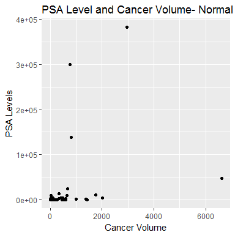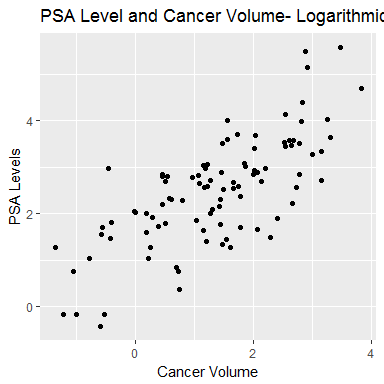

A clear relationship between PSA blood levels and cancer volume is seen in the logarithmic data, which is expected considering the role PSA level testing plays in prostate cancer screening. The logarithmic transformation also deals well with the outliers shown on the normal value plot.

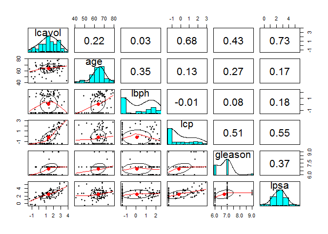

The pairs plot for the attributes reveal strong correlations between PSA levels, capsular penetration, and cancer volume. Age and prostate hyperplasia have a noticeable correlation with each other, neither is correlated with cancer volume or PSA levels to a degree that may serve useful for prediction.

### Analysis

#### Log Cancer Volume (lcavol) Prediction

In this section, log cancer volume regression prediction is performed using a linear regression model and a ctree decision tree model.

##### Linear Regression log cancer volume prediction

``` r
control <- trainControl(method = "cv")

set.seed(742)
vol_regression <- train(lcavol ~ ., data = prostate, method='lm', trControl = control)

summary(vol_regression$finalModel)
```

    ## 
    ## Call:
    ## lm(formula = .outcome ~ ., data = dat)
    ## 
    ## Residuals:
    ##      Min       1Q   Median       3Q      Max 
    ## -1.88964 -0.52719 -0.07263  0.57834  1.98728 
    ## 
    ## Coefficients:
    ##             Estimate Std. Error t value Pr(>|t|)    
    ## (Intercept) -1.49371    0.94261  -1.585   0.1165    
    ## age          0.01902    0.01063   1.789   0.0769 .  
    ## lbph        -0.08918    0.05376  -1.659   0.1006    
    ## lcp          0.29727    0.06762   4.396 2.98e-05 ***
    ## gleason      0.05240    0.11965   0.438   0.6625    
    ## lpsa         0.53955    0.07648   7.054 3.30e-10 ***
    ## ---
    ## Signif. codes:  0 '***' 0.001 '**' 0.01 '*' 0.05 '.' 0.1 ' ' 1
    ## 
    ## Residual standard error: 0.7015 on 91 degrees of freedom
    ## Multiple R-squared:  0.6642, Adjusted R-squared:  0.6457 
    ## F-statistic:    36 on 5 and 91 DF,  p-value: < 2.2e-16

As expected, lpsa results were the most significant, followed by lcp. It is more surprising that the gleason score did not have a regression model with any statistical significance.

``` r
vol_regression
```

    ## Linear Regression 
    ## 
    ## 97 samples
    ##  5 predictor
    ## 
    ## No pre-processing
    ## Resampling: Cross-Validated (10 fold) 
    ## Summary of sample sizes: 86, 89, 88, 89, 86, 88, ... 
    ## Resampling results:
    ## 
    ##   RMSE       Rsquared   MAE      
    ##   0.7210182  0.6407183  0.6018425
    ## 
    ## Tuning parameter 'intercept' was held constant at a value of TRUE

``` r
summary(prostate$lcavol)
```

    ##    Min. 1st Qu.  Median    Mean 3rd Qu.    Max. 
    ## -1.3471  0.5128  1.4469  1.3500  2.1270  3.8210

``` r
MAE(1.3500, prostate$lcavol)
```

    ## [1] 0.9477456

Although the regression model has not performed remarkably well, it does show a fair amount of success. The mean absolute error is shown to have been reduced by 0.34 on a log scale from estimating with simply the mean value. The mean absolute error is likely a better measure of overall success for the model, as the data exploration revealed some large outliers, which have a greater effect on the root mean squared error.

Because this data is modeled on a logarithmic scale, prediction error for lower values will be much lower than those for higher values.

    ##      description    mean_values third_quart_values max_values 
    ## [1,] "low error"    "5.6"       "33.509"           "1656.371" 
    ## [2,] "actual value" "22.387"    "133.968"          "6622.165" 
    ## [3,] "high error"   "89.504"    "535.602"          "26475.398"

These values show the range of cancer volume prediction within the mean absolute error calculated for this model.

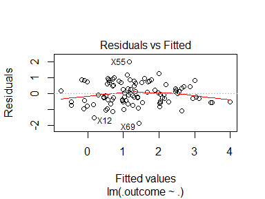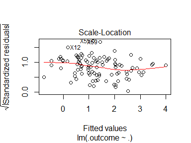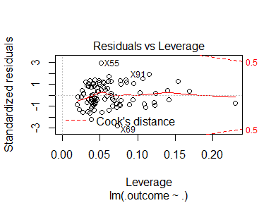

The plot of fitted values and residuals shows a very slight parabola, but its is likely not severe enough to be a sign of non-linear relationships, at least with data analysis using a log scale. The data points appear to be well spread-out also.

The quantiles and residuals plot shows some deviation at the lower or upper extremes, but this also may not be a sign that the model does not fail to explain the data..

On the fitted values and square root residuals plot, the data points are distributed fairly evenly.

The leverage and residuals plot shows that all values fall fairly well inside of the Cook's distance lines, indicating that there are no values that affect the regression results to a disproportionate degree.

#### Ctree decision tree log cancer volume prediction

In this section prediction of the log cancer volume data is performed using a ctree model, with parameter tuning through the caret package.

``` r
#k-fold cross validation is used to implement the model
ctree_control <- trainControl(method = "cv")

#Tuning parameters are set.
tune <- expand.grid(.mincriterion = c(0.5, 0.65, 0.75, 0.85, .95), .maxdepth = as.integer(c(2, 4, 6, 8, 10)))

#The ctree model is built using the caret::train function. lpsa is the value to be predicted.
set.seed(742)
ctree_model <- train(lcavol ~ ., data = prostate,method='ctree2', metric = "Rsquared", trControl = ctree_control, tuneGrid = tune)
```

``` r
varImp(ctree_model)
```

    ## loess r-squared variable importance
    ## 
    ##         Overall
    ## lpsa     100.00
    ## lcp       83.92
    ## gleason   31.51
    ## age       11.91
    ## lbph       0.00

As expected from the correlation results shown in the Data Exploration section, PSA level is the most important attribute for cancer volume prediction. The other attributes are found to be important roughly to the same degree as their respective correlations with cancer volume.

Below, the decisions of the model found to have the best results according to the root mean standard error are plotted.

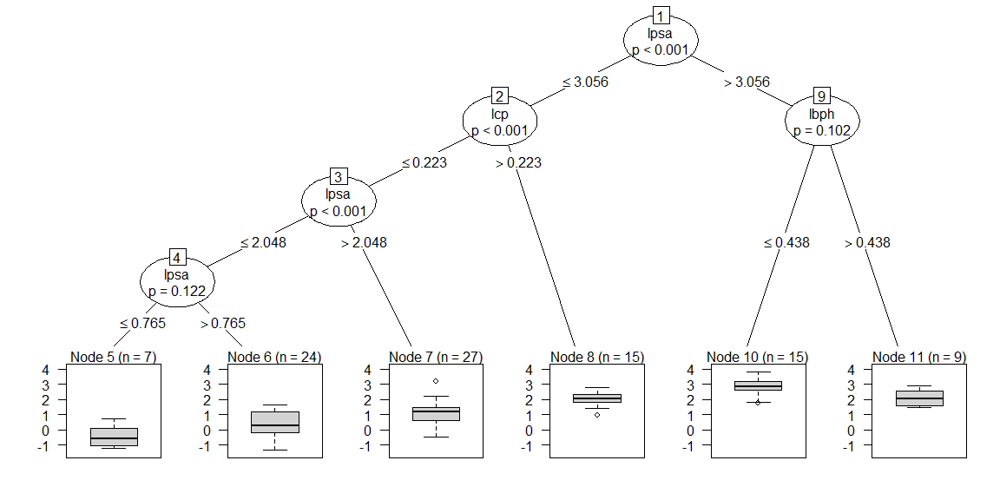

The most successful model allowed splits to occur at lower thresholds than the default parameters, allowing for some nodes with subtle differences to be created. The lowest threshold occurs on the age attribute split, \#6. This decision node selects records with age values over 65 for slightly higher average cancer volume. The dependence on PSA levels for a majority of the decisions is expected giving the previous measures of its importance.

``` r
ctree_model
```

    ## Conditional Inference Tree 
    ## 
    ## 97 samples
    ##  5 predictor
    ## 
    ## No pre-processing
    ## Resampling: Cross-Validated (10 fold) 
    ## Summary of sample sizes: 86, 89, 88, 89, 86, 88, ... 
    ## Resampling results across tuning parameters:
    ## 
    ##   mincriterion  maxdepth  RMSE       Rsquared   MAE      
    ##   0.50           2        0.9508792  0.4319854  0.7844128
    ##   0.50           4        0.8682532  0.5113780  0.6994605
    ##   0.50           6        0.8682532  0.5113780  0.6994605
    ##   0.50           8        0.8682532  0.5113780  0.6994605
    ##   0.50          10        0.8682532  0.5113780  0.6994605
    ##   0.65           2        0.9508792  0.4319854  0.7844128
    ##   0.65           4        0.8700137  0.5029897  0.7010825
    ##   0.65           6        0.8700137  0.5029897  0.7010825
    ##   0.65           8        0.8700137  0.5029897  0.7010825
    ##   0.65          10        0.8700137  0.5029897  0.7010825
    ##   0.75           2        0.9508792  0.4319854  0.7844128
    ##   0.75           4        0.8700137  0.5029897  0.7010825
    ##   0.75           6        0.8700137  0.5029897  0.7010825
    ##   0.75           8        0.8700137  0.5029897  0.7010825
    ##   0.75          10        0.8700137  0.5029897  0.7010825
    ##   0.85           2        0.9547181  0.4289831  0.7864032
    ##   0.85           4        0.8777961  0.4965587  0.7075218
    ##   0.85           6        0.8777961  0.4965587  0.7075218
    ##   0.85           8        0.8777961  0.4965587  0.7075218
    ##   0.85          10        0.8777961  0.4965587  0.7075218
    ##   0.95           2        0.9477368  0.4260748  0.7837513
    ##   0.95           4        0.8500997  0.5078222  0.6927263
    ##   0.95           6        0.8500997  0.5078222  0.6927263
    ##   0.95           8        0.8500997  0.5078222  0.6927263
    ##   0.95          10        0.8500997  0.5078222  0.6927263
    ## 
    ## Rsquared was used to select the optimal model using the largest value.
    ## The final values used for the model were maxdepth = 4 and mincriterion
    ##  = 0.5.

Although the second model had a higher Rsquared value than the other two p-value threshold tested through the mincriterion parameter, the root mean squared error, the estimator better representative of absolute accuracy, was lower than the other models.

``` r
summary(prostate$lcavol)
```

    ##    Min. 1st Qu.  Median    Mean 3rd Qu.    Max. 
    ## -1.3471  0.5128  1.4469  1.3500  2.1270  3.8210

``` r
MAE(1.3500, prostate$lcavol)
```

    ## [1] 0.9477456

Unfortunately the best mean average error value resulted in a difference of only 0.248 from simply predicting the mean lcavol value for each observation, which indicates rather low performance. The linear regression model was able to show better performance with this dataset using k-fold cross validation. It is noteworthy that a low mincriterion value showed the best performance for this ctree model, which indicates that the low correlation lbph value can be used to improve the model's fit.

### Log Protein Specific Antigen (PSA) Prediction

In this section, log prostate specific antigen regression prediction is performed using a linear regression model and a ctree decision tree model.

##### Linear Regression log PSA level prediction

``` r
control <- trainControl(method = "cv")

set.seed(742)
psa_regression <- model <- train(lpsa ~ ., data = prostate,method='lm', trControl = control)

summary(psa_regression$finalModel)
```

    ## 
    ## Call:
    ## lm(formula = .outcome ~ ., data = dat)
    ## 
    ## Residuals:
    ##      Min       1Q   Median       3Q      Max 
    ## -1.64877 -0.44423  0.06046  0.52235  2.06267 
    ## 
    ## Coefficients:
    ##             Estimate Std. Error t value Pr(>|t|)    
    ## (Intercept)  1.83165    1.03534   1.769   0.0802 .  
    ## lcavol       0.65523    0.09288   7.054  3.3e-10 ***
    ## age         -0.01027    0.01187  -0.865   0.3892    
    ## lbph         0.14506    0.05818   2.493   0.0145 *  
    ## lcp          0.07173    0.08171   0.878   0.3823    
    ## gleason      0.06168    0.13184   0.468   0.6410    
    ## ---
    ## Signif. codes:  0 '***' 0.001 '**' 0.01 '*' 0.05 '.' 0.1 ' ' 1
    ## 
    ## Residual standard error: 0.7731 on 91 degrees of freedom
    ## Multiple R-squared:  0.5748, Adjusted R-squared:  0.5515 
    ## F-statistic: 24.61 on 5 and 91 DF,  p-value: 1.349e-15

``` r
psa_regression
```

    ## Linear Regression 
    ## 
    ## 97 samples
    ##  5 predictor
    ## 
    ## No pre-processing
    ## Resampling: Cross-Validated (10 fold) 
    ## Summary of sample sizes: 87, 89, 87, 89, 87, 87, ... 
    ## Resampling results:
    ## 
    ##   RMSE       Rsquared   MAE      
    ##   0.7634485  0.5811444  0.6335977
    ## 
    ## Tuning parameter 'intercept' was held constant at a value of TRUE

The dataset performed slightly worse for PSA prediction than it did for cancer volume prediction, with RMSE, Rsquared, and MAE values all being approximately 0.05 worse than those seen in the cancer volume prediction model. The summary for the final model shows that the capsular penetration score, despite having a relatively strong correlation with PSA, did not lead to a statistically significant regression line.

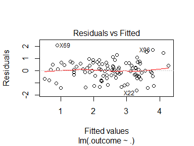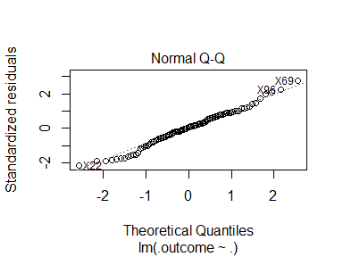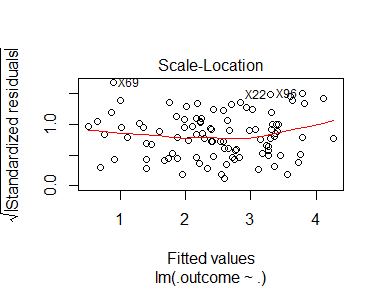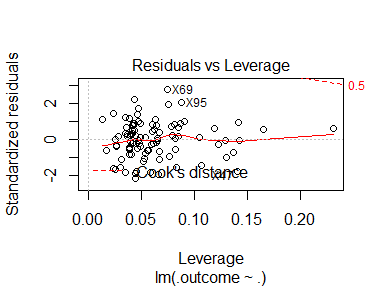 The plot results are very similar to those shown in the cancer volume prediction section. Overall the data points appear to fit even better than those seen in the cancer volume prediction section, which is surprising given that that regression model showed better performance overall. It may be that there is simply more variance in PSA levels that cannot be properly explained, even while the variance is even enough for the model to be a good representation of the data.

#### Ctree decision tree log PSA level prediction

``` r
#k-fold cross validation is used to implement the model.
ctree_control <- trainControl(method = "cv")

#Tuning parameters are set.
tune <- expand.grid(.mincriterion = c(0.5, 0.65, 0.75, 0.85, .95), .maxdepth = as.integer(c(2, 4, 6, 8, 10)))

#The ctree model is built using the caret::train function. lpsa is the value to be predicted.
set.seed(742)
ctree_model <- train(lpsa ~ ., data = prostate,method='ctree2', metric = "Rsquared", trControl = ctree_control, tuneGrid = tune)
```

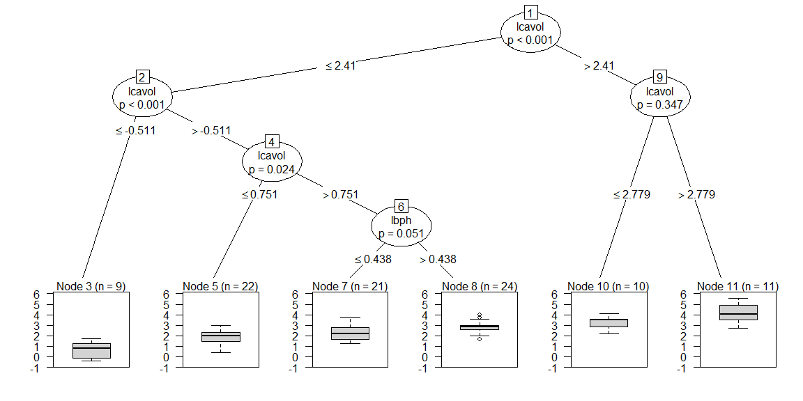

The most successful PSA ctree model allowed splits to occur at lower thresholds than the default parameters at approximately the same levels as the cancer volume ctree model. Also similarly to the previous ctree model there is a large dependence on only the highest correlated value, with only one node being based off of another attribute.

``` r
ctree_model
```

    ## Conditional Inference Tree 
    ## 
    ## 97 samples
    ##  5 predictor
    ## 
    ## No pre-processing
    ## Resampling: Cross-Validated (10 fold) 
    ## Summary of sample sizes: 87, 89, 87, 89, 87, 87, ... 
    ## Resampling results across tuning parameters:
    ## 
    ##   mincriterion  maxdepth  RMSE       Rsquared   MAE      
    ##   0.50           2        0.8957021  0.3691731  0.7655317
    ##   0.50           4        0.8657141  0.4551767  0.7272504
    ##   0.50           6        0.8587996  0.4587447  0.7220876
    ##   0.50           8        0.8587996  0.4587447  0.7220876
    ##   0.50          10        0.8587996  0.4587447  0.7220876
    ##   0.65           2        0.8929027  0.3703519  0.7615139
    ##   0.65           4        0.8592889  0.4500657  0.7212389
    ##   0.65           6        0.8509386  0.4548798  0.7146102
    ##   0.65           8        0.8509386  0.4548798  0.7146102
    ##   0.65          10        0.8509386  0.4548798  0.7146102
    ##   0.75           2        0.8929027  0.3703519  0.7615139
    ##   0.75           4        0.8551480  0.4506815  0.7207637
    ##   0.75           6        0.8490773  0.4558649  0.7141349
    ##   0.75           8        0.8490773  0.4558649  0.7141349
    ##   0.75          10        0.8490773  0.4558649  0.7141349
    ##   0.85           2        0.8929027  0.3703519  0.7615139
    ##   0.85           4        0.8632708  0.4376141  0.7259490
    ##   0.85           6        0.8572002  0.4427974  0.7193203
    ##   0.85           8        0.8572002  0.4427974  0.7193203
    ##   0.85          10        0.8572002  0.4427974  0.7193203
    ##   0.95           2        0.9075223  0.3716742  0.7718866
    ##   0.95           4        0.8955196  0.4037863  0.7653759
    ##   0.95           6        0.8955196  0.4037863  0.7653759
    ##   0.95           8        0.8955196  0.4037863  0.7653759
    ##   0.95          10        0.8955196  0.4037863  0.7653759
    ## 
    ## Rsquared was used to select the optimal model using the largest value.
    ## The final values used for the model were maxdepth = 6 and mincriterion
    ##  = 0.5.

The minimum criteria for a split and and the maximum depth of the tree were tuned to create the best stree results. There were only minor variations shown however.

``` r
summary(prostate$lpsa)
```

    ##    Min. 1st Qu.  Median    Mean 3rd Qu.    Max. 
    ## -0.4308  1.7317  2.5915  2.4784  3.0564  5.5829

``` r
MAE(2.4784, prostate$lpsa)
```

    ## [1] 0.8905797

Like the ctree prediction results for log cancer volume, the log psa prediction does not show a significant improvement over simply predicting the mean value for each observation- the difference being only 0.168. As with the cancer volume prediction models, the ctree model performed slightly worse than the regression model.

### Conclusion

For both cancer volume and prostate specific antigen prediction a linear regression model showed better predictive results than ctree models when tested with 10-fold cross validation. Neither model type was able to predict either attribute with strong values of root mean squared error, mean absolute error, and Rsquared measures however.

#### References

Kim, B. (2015). Understanding Diagnostic Plots for Linear Regression Analysis. Retrieved December 08, 2017, from <http://data.library.virginia.edu/diagnostic-plots/>

Prostate-Specific Antigen (PSA) Test. (n.d.). Retrieved November 11, 2017, from <https://www.cancer.gov/types/prostate/psa-fact-sheet>
