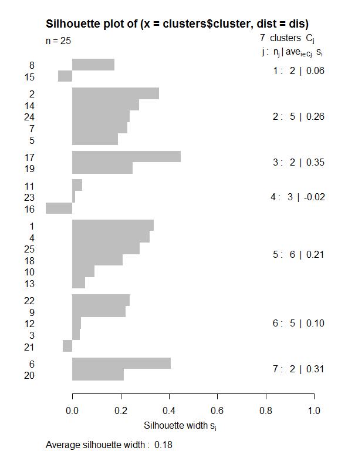

Clustering of European Countries by Protein Consumption
================

#### Daniel Davis

##### IS675 Fall 2017 Final Question 3

### Introduction

Analyze with k-means and 2 different methods of hierarchical clustering (new thing) and compare the results and discuss/evaluate. This case study attempts to cluster European countries based on the percentage intake from nine types of protein sources. K-means, hclust and diana clustering are performed and evaluated.

### Data Exploration

``` r
str(protein)
```

    ## 'data.frame':    25 obs. of  10 variables:
    ##  $ Country  : Factor w/ 25 levels "Albania","Austria",..: 1 2 3 4 5 6 7 8 9 10 ...
    ##  $ RedMeat  : num  10.1 8.9 13.5 7.8 9.7 10.6 8.4 9.5 18 10.2 ...
    ##  $ WhiteMeat: num  1.4 14 9.3 6 11.4 10.8 11.6 4.9 9.9 3 ...
    ##  $ Eggs     : num  0.5 4.3 4.1 1.6 2.8 3.7 3.7 2.7 3.3 2.8 ...
    ##  $ Milk     : num  8.9 19.9 17.5 8.3 12.5 25 11.1 33.7 19.5 17.6 ...
    ##  $ Fish     : num  0.2 2.1 4.5 1.2 2 9.9 5.4 5.8 5.7 5.9 ...
    ##  $ Cereals  : num  42.3 28 26.6 56.7 34.3 21.9 24.6 26.3 28.1 41.7 ...
    ##  $ Starch   : num  0.6 3.6 5.7 1.1 5 4.8 6.5 5.1 4.8 2.2 ...
    ##  $ Nuts     : num  5.5 1.3 2.1 3.7 1.1 0.7 0.8 1 2.4 7.8 ...
    ##  $ Fr.Veg   : num  1.7 4.3 4 4.2 4 2.4 3.6 1.4 6.5 6.5 ...

``` r
apply(protein[,-1], 1, sum)
```

    ##  [1] 71.2 86.4 87.3 90.6 82.8 89.8 75.7 90.4 98.2 97.7 84.3 91.3 84.0 84.7
    ## [15] 81.7 92.7 75.6 86.9 77.2 80.0 88.1 88.4 91.9 79.3 88.5

This data set is not an exhaustive list of the protein sources for the included countries, but does represent a large majority for each country.

``` r
apply(protein[,-1], 2, summary)
```

    ##         RedMeat WhiteMeat  Eggs   Milk   Fish Cereals Starch  Nuts Fr.Veg
    ## Min.      4.400     1.400 0.500  4.900  0.200  18.600  0.600 0.700  1.400
    ## 1st Qu.   7.800     4.900 2.700 11.100  2.100  24.300  3.100 1.500  2.900
    ## Median    9.500     7.800 2.900 17.600  3.400  28.000  4.700 2.400  3.800
    ## Mean      9.828     7.896 2.936 17.112  4.284  32.248  4.276 3.072  4.136
    ## 3rd Qu.  10.600    10.800 3.700 23.300  5.800  40.100  5.700 4.700  4.900
    ## Max.     18.000    14.000 4.700 33.700 14.200  56.700  6.500 7.800  7.900

On average cereals provide the largest protein source out of the included categories, with milk coming in second place.


From this plot it is clear that Eastern European countries tended to have a greater protein intake from cereals than other countries.


On the other hand, a large percentage of protein intake from red meat is found in Western European countries, especially the British Isles.

These differences indicate that clustering based on protein type may have a strong connection with geographic factors. Economic factors may also play a role, considering the stark difference between the USSR and other Iron Curtain countries and Western Europe, however the time period from when this data was gathered is unknown.

### Analysis

For this first analysis, k-means clustering is performed using the kmeans function in the R stats package.

``` r
#The protein intake percentages are normalized through min-max normalization.
protein_n <- as.data.frame(lapply(protein[,-1], normalize))


#The kmeans function is applied to the normalized data.
set.seed(79835)
clusters <- kmeans(protein_n, 5)
```

``` r
clusters$size
```

    ## [1] 4 8 2 5 6

``` r
# look at the cluster centers
clusters$centers
```

    ##     RedMeat WhiteMeat      Eggs       Milk      Fish   Cereals    Starch
    ## 1 0.4007353 0.4484127 0.6309524 0.75607639 0.5732143 0.1069554 0.6694915
    ## 2 0.6479779 0.7331349 0.8303571 0.56467014 0.2267857 0.1601050 0.6864407
    ## 3 0.1654412 0.1706349 0.3809524 0.06423611 0.7428571 0.2493438 0.8813559
    ## 4 0.2588235 0.6857143 0.5571429 0.31041667 0.1814286 0.4498688 0.8406780
    ## 5 0.2610294 0.2433862 0.2976190 0.22974537 0.1321429 0.7497813 0.2401130
    ##         Nuts    Fr.Veg
    ## 1 0.06690141 0.1115385
    ## 2 0.19190141 0.4269231
    ## 3 0.64788732 0.9461538
    ## 4 0.25915493 0.4400000
    ## 5 0.65962441 0.4282051

``` r
countries <- as.character(protein$Country)
cluster_results <- cbind(countries, clusters$cluster)

cluster_results <- as.data.frame(cluster_results)
colnames(cluster_results) <- c("Country", "Cluster")

cluster_results[order(cluster_results$Cluster),]
```

    ##           Country Cluster
    ## 6         Denmark       1
    ## 8         Finland       1
    ## 15         Norway       1
    ## 20         Sweden       1
    ## 2         Austria       2
    ## 3         Belgium       2
    ## 9          France       2
    ## 12        Ireland       2
    ## 14    Netherlands       2
    ## 21    Switzerland       2
    ## 22             UK       2
    ## 24      W Germany       2
    ## 17       Portugal       3
    ## 19          Spain       3
    ## 5  Czechoslovakia       4
    ## 7       E Germany       4
    ## 11        Hungary       4
    ## 16         Poland       4
    ## 23           USSR       4
    ## 1         Albania       5
    ## 4        Bulgaria       5
    ## 10         Greece       5
    ## 13          Italy       5
    ## 18        Romania       5
    ## 25     Yugoslavia       5

The clustering procedure divided the included countries perfectly into different geographical regions of Europe. The first cluster represents Northern Europe and Scandinavia, with a high percentage of protein intake from milk, starch, eggs, and fish, as well as very low intake from nuts. The second cluster represents Western Europe as well as the non-Soviet bloc Central European countries West Germany and Austria, with the highest percentages of protein intake from eggs, white meat, and red meat. The smallest cluster, 3, is composed of Portugal and Spain. This cluster has the highest percentage of intake from fruits and vegetables, as well as a high percentage intake from starch and fish. The fourth cluster consists of the USSR and Eastern European bloc countries. These countries have a very high percentage of starch intake, and relatively high white meat intake. The fifth cluster is the most diverse politically, but is very close in geographical terms, consisting of Greece, the Balkan states of Albania and Yugoslavia, Romania, and Italy. This cluster has the highest intake of cereals and nuts, and the lowest intake of starch.

Below, the clustering procedure is repeated with 7 clusters rather than the initial value chosen of five.

``` r
#The kmeans function is applied to the normalized data with a higher number of clusters.
set.seed(79835)
clusters <- kmeans(protein_n, 7)
```

``` r
clusters$size
```

    ## [1] 2 5 2 3 6 5 2

There are multiple smaller clusters, indicating that the results may be more homogeneous than those seen earlier.

``` r
countries <- as.character(protein$Country)
cluster_results <- cbind(countries, clusters$cluster)

cluster_results <- as.data.frame(cluster_results)
colnames(cluster_results) <- c("Country", "Cluster")

cluster_results[order(cluster_results$Cluster),]
```

    ##           Country Cluster
    ## 8         Finland       1
    ## 15         Norway       1
    ## 2         Austria       2
    ## 5  Czechoslovakia       2
    ## 7       E Germany       2
    ## 14    Netherlands       2
    ## 24      W Germany       2
    ## 17       Portugal       3
    ## 19          Spain       3
    ## 11        Hungary       4
    ## 16         Poland       4
    ## 23           USSR       4
    ## 1         Albania       5
    ## 4        Bulgaria       5
    ## 10         Greece       5
    ## 13          Italy       5
    ## 18        Romania       5
    ## 25     Yugoslavia       5
    ## 3         Belgium       6
    ## 9          France       6
    ## 12        Ireland       6
    ## 21    Switzerland       6
    ## 22             UK       6
    ## 6         Denmark       7
    ## 20         Sweden       7

These results are not significantly different from those shown previously. The main difference is the splitting of Northern European countries, and the formation of a cluster consisting of Central European countries and the Netherlands. Interestingly, the Southern European cluster did not change. Geographically these results appear to be as valid as the previous results. The only surprise is the cluster of Norway and Finland excluding Sweden.

A silhouette plot can be used to compare the clustering results to a dissimilarity matrix.



The silhouette results show fairly poor similarity within the clusters. Finland, Poland and Switzerland appear to be extremely dissimlar to the members of their respective clusters.

### Hierarchical Agglomerative Clustering with Hclust

Hclust performs clustering in an agglomeration manner, beginning with each observation in its own cluster, and combining these clusters until each observation is included in a single cluster. At each stage, the two clusters that are most similar are combined.

``` r
set.seed(79835)
hcluster_results <- hclust(dist(protein_n))

protein_n$Country <- protein$Country

hcluster_dendrogram <- as.dendrogram(hcluster_results)

labels(hcluster_dendrogram) <- protein_n[hcluster_results$order, "Country"]

ggplot(hcluster_dendrogram  %>% set('labels_cex', 0.6), horiz = TRUE)
```


``` r
protein_n$Country <- NULL

hcluster_results
```

    ## 
    ## Call:
    ## hclust(d = dist(protein_n))
    ## 
    ## Cluster method   : complete 
    ## Distance         : euclidean 
    ## Number of objects: 25

The dendrogram created from the hclust results shows similar clusters to those created using the k-means algorithm, but more information can be gleaned from the tree structure. The k-means results indicated that the Eastern European countries were mostly a single group, while the dendrogram reveals that there is no such solidarity.

Below, silhouette plots are created for different numbers of clusters, ranging from two to seven, in an attempt to discover how hclust's tree structure can best be consolidated into clusters.


The silhouette results show that three clusters leads to the highest score. With this number of clusters some interesting groupings are still visible. As shown below, the first cluster consists primarily of Eastern European countries, with Greece and Italy included. It is noteworthy that Czechoslovakia is included in the cluster consisting of West and Northern European countries. The protein intake for Spain and Portugal is apparently more similar than other country groupings, as they make up a single cluster.

    ##           Country Cluster
    ## 1         Albania       1
    ## 4        Bulgaria       1
    ## 10         Greece       1
    ## 11        Hungary       1
    ## 13          Italy       1
    ## 18        Romania       1
    ## 23           USSR       1
    ## 25     Yugoslavia       1
    ## 2         Austria       2
    ## 3         Belgium       2
    ## 5  Czechoslovakia       2
    ## 6         Denmark       2
    ## 7       E Germany       2
    ## 8         Finland       2
    ## 9          France       2
    ## 12        Ireland       2
    ## 14    Netherlands       2
    ## 15         Norway       2
    ## 16         Poland       2
    ## 20         Sweden       2
    ## 21    Switzerland       2
    ## 22             UK       2
    ## 24      W Germany       2
    ## 17       Portugal       3
    ## 19          Spain       3

### Divisive Hierarchical Clustering with Diana

The diana algorithm performs hierarchical clustering in the opposite direction from the hclust algorithm, starting from a single all-inclusive cluster, and dividing into increasingly smaller clusters down to a single cluster for each observation. At each stage, the cluster with the largest average dissimilarity is split. Below, diana clustering is performed on the normalized protein intake dataset. As with the hclust algorithm, a dissimilarity matrix of the dataset is passed to the diana function.

``` r
set.seed(79835)
diana_results <- diana(dist(protein_n))
```


The diana dendrogram shows more expected results from a geographical perspective. Below, the same silhouette procedure is repeated as was performed on the hclust results.


Interestingly, the diana results confirmed that 3 clusters had the best fit for the observations.

    ##           Country Cluster
    ## 1         Albania       1
    ## 4        Bulgaria       1
    ## 10         Greece       1
    ## 11        Hungary       1
    ## 13          Italy       1
    ## 18        Romania       1
    ## 25     Yugoslavia       1
    ## 2         Austria       2
    ## 3         Belgium       2
    ## 5  Czechoslovakia       2
    ## 6         Denmark       2
    ## 7       E Germany       2
    ## 8         Finland       2
    ## 9          France       2
    ## 12        Ireland       2
    ## 14    Netherlands       2
    ## 15         Norway       2
    ## 16         Poland       2
    ## 20         Sweden       2
    ## 21    Switzerland       2
    ## 22             UK       2
    ## 23           USSR       2
    ## 24      W Germany       2
    ## 17       Portugal       3
    ## 19          Spain       3

The only difference between the three-cluster groupings between hclust and diana results is that the diana clustering placed the USSR with the second rather than the first cluster.

Below, k-means clustering is repeated again with the specification for three clusters.

``` r
set.seed(79835)
clusters <- kmeans(protein_n, 3)
```

``` r
countries <- as.character(protein$Country)
cluster_results <- cbind(countries, clusters$cluster)

cluster_results <- as.data.frame(cluster_results)
colnames(cluster_results) <- c("Country", "Cluster")

cluster_results[order(cluster_results$Cluster),]
```

    ##           Country Cluster
    ## 1         Albania       1
    ## 4        Bulgaria       1
    ## 10         Greece       1
    ## 11        Hungary       1
    ## 13          Italy       1
    ## 18        Romania       1
    ## 23           USSR       1
    ## 25     Yugoslavia       1
    ## 2         Austria       2
    ## 3         Belgium       2
    ## 5  Czechoslovakia       2
    ## 6         Denmark       2
    ## 7       E Germany       2
    ## 8         Finland       2
    ## 9          France       2
    ## 12        Ireland       2
    ## 14    Netherlands       2
    ## 15         Norway       2
    ## 16         Poland       2
    ## 20         Sweden       2
    ## 21    Switzerland       2
    ## 22             UK       2
    ## 24      W Germany       2
    ## 17       Portugal       3
    ## 19          Spain       3

The k-means clustering agrees exactly with the hclust results.

### Conclusions

Clustering on protein intake percentages for European countries largely confirmed geographical differences. Each clustering algorithm tested, k-means, hclust, and diana produced extremely similar results. The silhouette widths for the clusters were not incredibly high, but moderate agreement was seen with small cluster sizes.In general a split was seen between Eastern and Western European countries, with Spain and Portugal consistently grouped together apart from the other clusters.

#### References

Kodali, T. (2016, January 22). Hierarchical Clustering in R. Retrieved November 20, 2017, from <https://www.r-bloggers.com/hierarchical-clustering-in-r-2/>

Lantz, B. (2015). Machine learning with R: discover how to build machine learning algorithms, prepare data, and dig deep into data prediction techniques with R. Birmingham: PACKT Publishing.

<https://www.statmethods.net/advstats/cluster.html>

<https://www.stat.berkeley.edu/~spector/s133/Clus.html>

<https://stat.ethz.ch/R-manual/R-devel/library/cluster/html/diana.html>

<https://stat.ethz.ch/R-manual/R-devel/library/stats/html/hclust.html>
